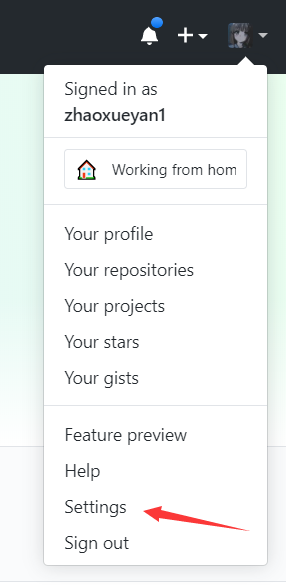
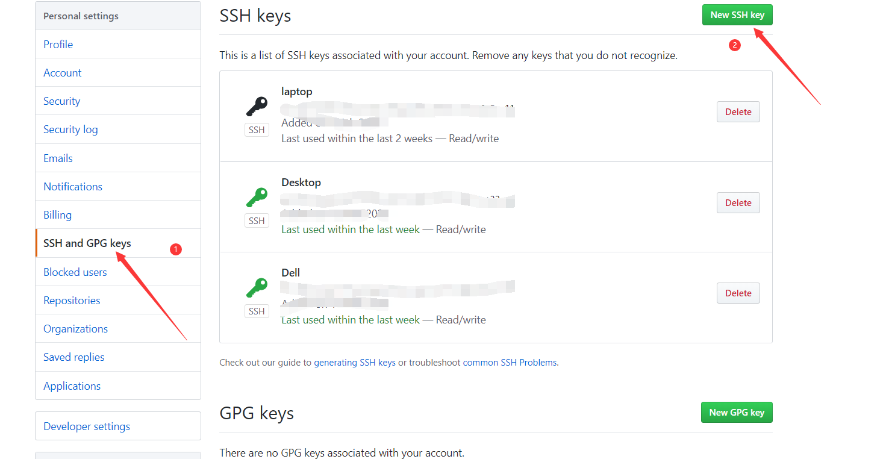
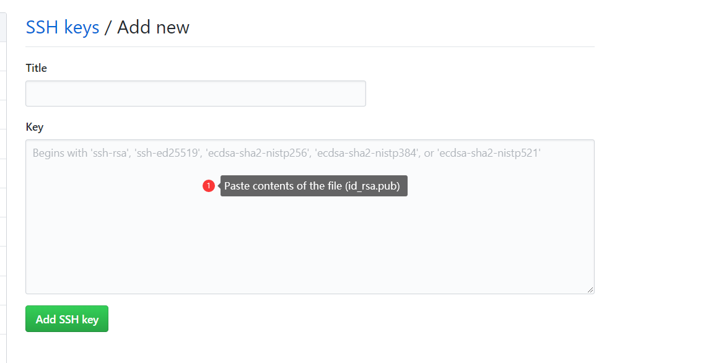

# wlbx
A repair order process system for EDU network

# Pipeline

# Key

# How to use Git

## 1. Download Git-Setup tools

## 2. Configure Your Account Informations

- Open terminal and type the following commands to configure your account:
```Shell
$ git config --global user.name "xxx"
$ git config --global user.email "xxx@xxx.com"
```
## 3. Generating Your SSH Public Key

```Shell
$ ssh-keygen -o
Generating public/private rsa key pair.
Enter file in which to save the key (/home/schacon/.ssh/id_rsa):
Created directory '/home/schacon/.ssh'.
Enter passphrase (empty for no passphrase):
Enter same passphrase again:
Your identification has been saved in /home/schacon/.ssh/id_rsa.
Your public key has been saved in /home/schacon/.ssh/id_rsa.pub.
The key fingerprint is:
d0:82:24:8e:d7:f1:bb:9b:33:53:96:93:49:da:9b:e3 schacon@mylaptop.local
$ cat ~/.ssh/id_rsa.pub
ssh-rsa AAAAB3NzaC1yc2EAAAABIwAAAQEAklOUpkDHrfHY17SbrmTIpNLTGK9Tjom/BWDSU
GPl+nafzlHDTYW7hdI4yZ5ew18JH4JW9jbhUFrviQzM7xlELEVf4h9lFX5QVkbPppSwg0cda3
Pbv7kOdJ/MTyBlWXFCR+HAo3FXRitBqxiX1nKhXpHAZsMciLq8V6RjsNAQwdsdMFvSlVK/7XA
t3FaoJoAsncM1Q9x5+3V0Ww68/eIFmb1zuUFljQJKprrX88XypNDvjYNby6vw/Pb0rwert/En
mZ+AW4OZPnTPI89ZPmVMLuayrD2cE86Z/il8b+gw3r3+1nKatmIkjn2so1d01QraTlMqVSsbx
NrRFi9wrf+M7Q== schacon@mylaptop.local
```
## 4. Add Your SSH Public Key to GitHub





## 5. Pull The Repository

```Shell
$ cd ~
$ mkdir wlbx
$ cd wlbx
$ git init
$ git pull git@github.com:XDUNA/wlbx.git master
remote: Enumerating objects: 4, done.
remote: Counting objects: 100% (4/4), done.
remote: Compressing objects: 100% (4/4), done.
remote: Total 4 (delta 0), reused 0 (delta 0), pack-reused 0
Unpacking objects: 100% (4/4), 3.21 KiB | 84.00 KiB/s, done.
From github.com:XDUNA/wlbx
 * branch            master     -> FETCH_HEAD
Already up to date.
```

## 6. Push your commits

After you have changed the source. 
```Shell
$ cd wlbx
$ git add .
$ git commit -m "The message of this commits"
$ git push --set-upstream git@github.com:XDUNA/wlbx.git master
Enumerating objects: 5, done.
Counting objects: 100% (5/5), done.
Delta compression using up to 4 threads
Compressing objects: 100% (3/3), done.
Writing objects: 100% (3/3), 358 bytes | 179.00 KiB/s, done.
Total 3 (delta 0), reused 0 (delta 0)
To github.com:XDUNA/wlbx.git
   e03ac03..ca81f2d  master -> master
```
